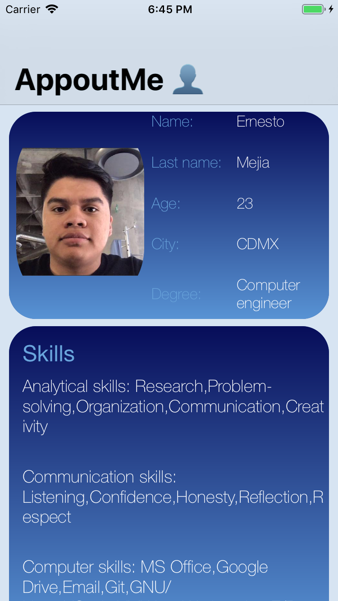
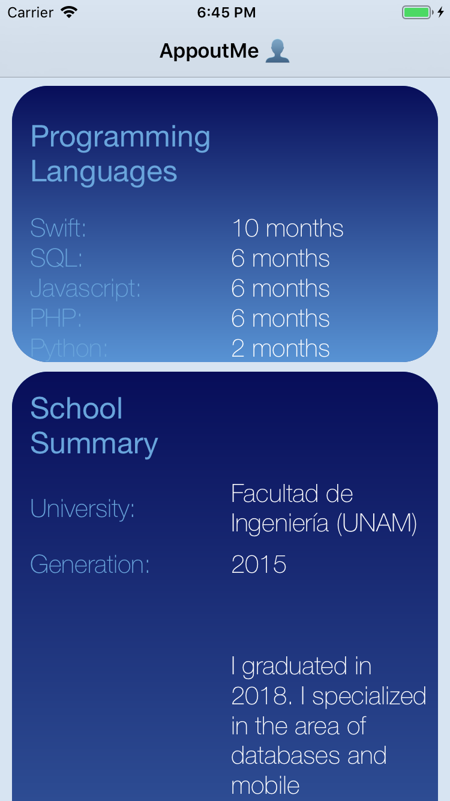
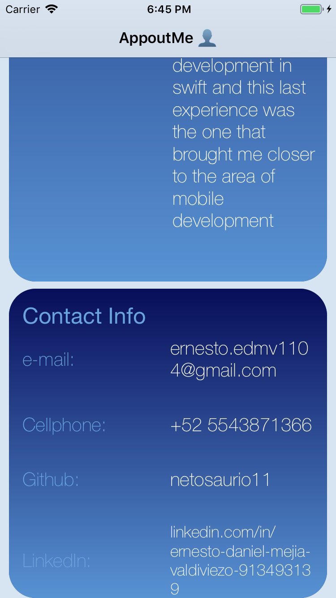

# AppoutMe
AppoutMe is an app that its main objective is show some informations about me Ernesto Daniel, somethings like my skills, my work experience and even personal information like my scholar carreer and contact info.
## Specifications
* This project was development to check the developer´s habilities and profile too. The above through an app that gets a JSON file from gist repository and that file contains information about the developer, that informations is shown in the app, in that way the people on charge to check the app can know different things about the developer.
* This app was made for iOS 12.1, you need XCode 10.1 to run it.

* **Architecture:**
MVVM
* **gists repository:**
https://gist.githubusercontent.com/em964/b9f51d2a2de6d7bb25360f2d78356866/raw/ab9f16924f8e89de5461ac78c65d3cb501bd3e1d/PersonalInfo.json
* **Developer:**
Ernesto Daniel Mejia Valdiviezo

## How the App looks like

